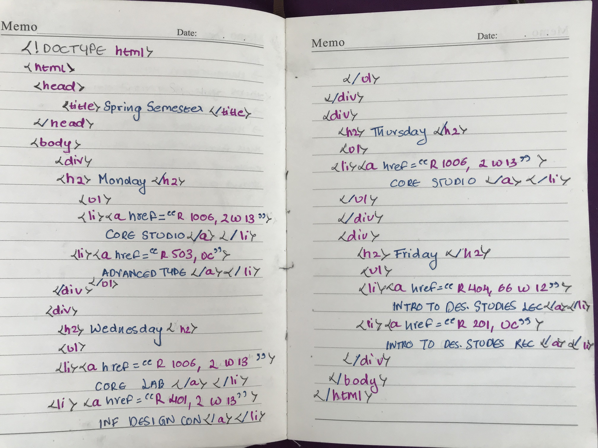

# `📖` Handwritten Code
> **[Core Interaction Lab](https://github.com/majiinbju/core-interaction-2017)** 
> *Parsons School of Design 
> Communication Design 
> Spring 2018 &nbsp;&middot;&nbsp;
> Wednesday / 9:00 – 11:40 am*
> 
---
## 🎯 Objective
> Create one handwritten page of HTML code that is an unordered list of your class schedule this term at university.
---
## 🧪 Results

---
## ✅ Requirements
> - Make sure your code also (at least) contains: `<html>, <head>, <title>`
> - Wrap a hyperlink inside each `<li>`, this hyperlink will have `href="____"` and inside the quotes will be the location (space and/or time) of your class in English. The information in the quotes can be however detailed and in whatever format you like.
> - Use at least 3 colors and make a conscious decision about representing different parts of the code.
---
> [bajju.info](https://www.bajju.info) &nbsp;&middot;&nbsp;
> [@majiinbju](https://github.com/majiinbju) &nbsp;&middot;&nbsp;
> [linkedin](https://www.linkedin.com/in/vivek-bajaj-4a8035152/) &nbsp;&middot;&nbsp;
> [email](mailto:hi@vivekbajaj.design)
---
