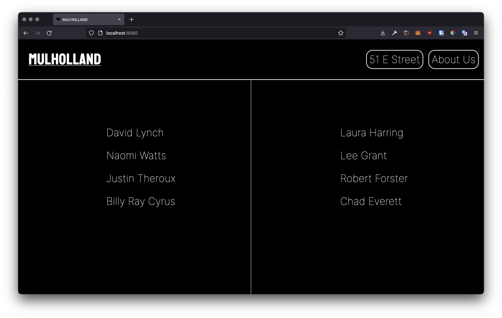

# `📖` Cafe Menu
> **[Core Interaction Lab](https://github.com/majiinbju/core-interaction-2017)** 
> *Parsons School of Design 
> Communication Design 
> Spring 2018 &nbsp;&middot;&nbsp;
> Wednesday / 9:00 – 11:40 am*
> 
---
## `🎯` Objective
> Create a menu for a cafe or restaurant of your imagination. It can be a menu for drinks or food or both. It can have prices, or descriptions of food, or options for food like toppings and sauces, or ingredients, or information about food allergies, or any other information about the items. 
> There should be 3 sections to your page: a header and two columns. 
> The top of the page should contain the name of the cafe and can contain any other information like address, hours, other information about the cafe. Food or drink items should be in the columns.
---
## `🧪` Results

---
## `✅` Requirements
> - The painting should be recreated entirely using `
` colored with CSS background-color.
> - Some `
` will be container `
` that are invisible, but divide up space.
> - Use `%` units, allow the painting to take up the full canvas of the HTML page, it’s okay if it appears stretched if the window is also stretched.

---
> [bajju.info](https://www.bajju.info) &nbsp;&middot;&nbsp;
> [@majiinbju](https://github.com/majiinbju) &nbsp;&middot;&nbsp;
> [linkedin](https://www.linkedin.com/in/vivek-bajaj-4a8035152/) &nbsp;&middot;&nbsp;
> [email](mailto:hi@vivekbajaj.design)
---
