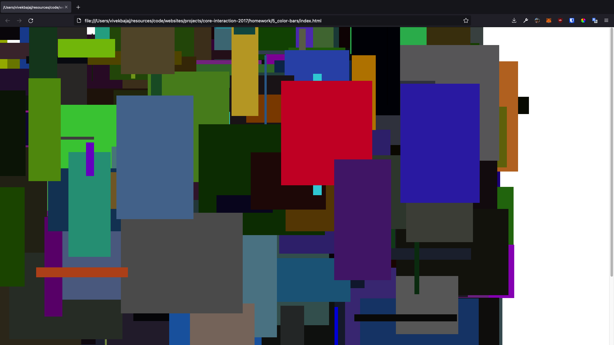

# `📖` Generative Rectangles
> **[Core Interaction Lab](https://github.com/majiinbju/core-interaction-2017)**<br>
> *Parsons School of Design<br>
> Communication Design<br>
> Spring 2018 &nbsp;&middot;&nbsp;
> Wednesday / 9:00 – 11:40 am*
> 
---
## `🎯` Objective
> Using a while loop, create divs with random **positions**, **dimensions** and **color**.
---
## `🧪` Results

---
## `✅` Requirements
> One line of `<style>` CSS:
```css
div {
position: absolute;
}
```
> Just as we set `d.style.backgroundColor`, you can set other style properties the same way, like `d.style.width` 
---
## `💳` Extra Credit
> Build an HSL random color instead of a RGB random color. The HSL string is very similar, difference being additional `%` marks, and the multiplier is different, the range of the numbers are no longer between `0` and `256`
---
> [bajju.info](https://www.bajju.info) &nbsp;&middot;&nbsp;
> [@majiinbju](https://github.com/majiinbju) &nbsp;&middot;&nbsp;
> [linkedin](https://www.linkedin.com/in/vivek-bajaj-4a8035152/) &nbsp;&middot;&nbsp;
> [email](mailto:hi@vivekbajaj.design)
---
